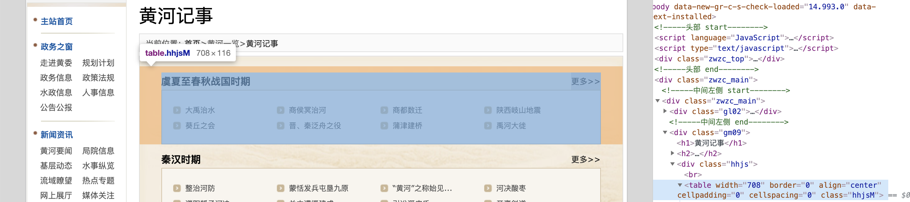
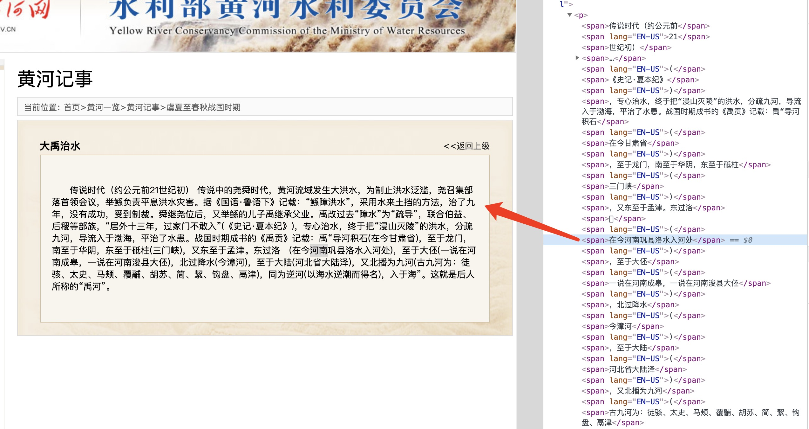

# 黄河大事记

2021-11-04, updated: by [SongshGeo](songshgeo@gmail.com)

## 数据字典

event: 对大事记的具体详细描述

period: 所属时期

title: 网站上对该事件所起的名字

## 数据获取方式

此套数据是我在黄河网[黄河记事]("http://www.yrcc.gov.cn/hhyl/hhjs/")的栏目下爬取的。

该网站分成下述时期：

{'yxcqzg': '虞夏至春秋战国时期',
 'qhsq': '秦汉时期',
 'wjnbc': '魏晋南北朝时期',
 'stwd': '隋唐五代时期',
 'bs': '北宋时期',
 'jy': '金元时期',
 'md': '明代',
 'qd': '清代',
 'mgsq': '民国时期',
 'zhrmghg': '中华人民共和国时期'}

在该栏目下，古代（民国之前）都是按照断代史与各朝代的大事件进行划分的。而民国之后尤其是新中国时期（mgsq和zhrmghg），则是按照年份进行划分的。因此对于古代时期首先按照事件爬取其名称，对近现代先逐步进入各年份再进行爬取。

接下来爬取具体数据（事件描述）：

